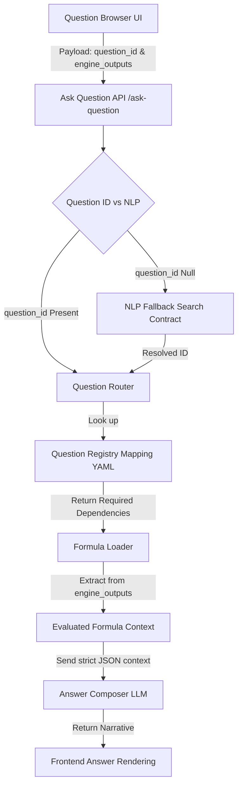

# PHASE 10B: BACKEND CONTRACT REVIEW & IMPLEMENTATION READINESS

## 1. Architecture Diagram
The following Mermaid diagram maps the end-to-end data lifecycle resulting from the newly established backend contracts.



## 2. Data Flow
1. **Initiation:** The Frontend dispatches an HTTP POST containing the pre-calculated math (`engine_outputs`) and the user's intent (`question_id`).
2. **Resolution:** The API layer guarantees a valid `question_id`. If omitted, the Free Text Fallback resolves the intent to a deterministic ID.
3. **Extraction:** The Question Router reads the `QUESTION_REGISTRY_MAPPING_v1.md` schema associated with the ID and plucks ONLY the necessary variables (e.g., Mahadasha Lord) from the master payload.
4. **Composition:** The exact, mathematical data points are serialized into a strict context prompt for the LLM to format into human language.

## 3. Payload Examples

**Client-to-Server Request:**
```json
{
  "question_id": "7.2",
  "engine_outputs": { ... massive dictionary ... }
}
```

**Router-to-Composer Internal Prompt:**
```json
{
  "system_instruction": "Format the following astrological data regarding Marriage Timing.",
  "data_context": {
    "natal_promise_score": 75,
    "active_mahadasha": "Venus"
  }
}
```

## 4. Validation Rules
- **Contract Boundary Validations:** API payloads failing to provide `engine_outputs` or an invalid `question_id` (without valid free-text fallback) automatically throw 4XX HTTP exceptions.
- **Engine Output Validations:** The Router will abort synthesis if a registry node mandates `timing_required: true` but the frontend `engine_outputs` dictionary lacks the `dashas.synthesis` block.

## 5. Risk Analysis
**Risk:** **NLP Free Text Drift**
- *Description:* If the NLP Fallback evaluates the query "When will I die?" to a non-existent Domain 8 sub-question, the Router could crash.
- *Mitigation:* The NLP layer must map exclusively to keys explicitly registered in the Registry Dictionary. If confidence is low, it must hard-fail rather than hallucinate a response.

**Risk:** **Dasha Data Latency/Desync**
- *Description:* The `Favorites` and `Recent Questions` components store static IDs locally. If the user's Dasha changes over months, asking the saved question might be evaluated on stale `engine_outputs` if the UI doesn't force a fresh calculation.
- *Mitigation:* Ensure the `engine_outputs` payload provided to the API is strictly the active, real-time calculation representing the exact moment the `[ Ask ]` button is pushed.

## 6. Implementation Readiness
**Status: READY FOR BACKEND IMPLEMENTATION**

- **Framework Readiness:** The Python/FastAPI environment is uniquely suited to implement these modular routing concepts.
- **Safety:** The contract explicitly walls off the `DashaEngine`, `TransitEngine`, and `NatalPromiseEngine`. There is zero threat of recalculation logic polluting the API boundary.
- **Next Step (Phase 10C):** Develop the internal Python logic for the `FormulaLoader` and `Question Router` implementing this contract design.
