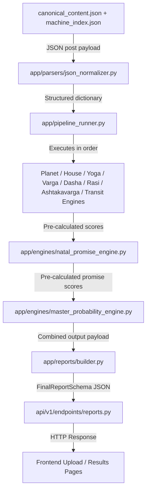

# PYTHON_FILE_AUDIT.md

## Codebase Audit Summary
This document contains the audit findings for the Python codebase of the Vedic-AI system. It maps all Python files in the `backend/` directory, classifies them, traces the execution path, identifies conflicts/duplicates, and explains the root cause of the current runtime issues.

---

## 1. File Inventory and Classification

| File | Purpose | Imported By | Actively Used | Duplicate Risk | Classification | Recommendation |
| :--- | :--- | :--- | :---: | :--- | :--- | :--- |
| `backend/main.py` | FastAPI server entry point | None (executed directly) | **Yes** | None | `ACTIVE` | Keep. Core entry point. |
| `backend/run.py` | Command-line entry point to test pipeline | None (executed directly) | **Yes** | None | `ACTIVE` | Keep. Key development CLI runner. |
| `backend/trace_chart.py` | Debugging script to trace pipeline scores | None (executed directly) | **Yes** | None | `REFERENCE` | Keep. Very useful developer diagnostics tool. |
| `backend/app/pipeline_runner.py` | Orchestrates normalized data flow to all engines | `main.py`, `run.py`, `api/v1/endpoints/charts.py`, `api/v1/endpoints/reports.py` | **Yes** | None | `ACTIVE` | Keep. Core calculation pipeline driver. |
| `backend/app/api/v1/router.py` | Declares v1 subrouters | `app/main.py` | **Yes** | None | `ACTIVE` | Keep. Standard router configuration. |
| `backend/app/api/v1/endpoints/charts.py` | `/process-chart` endpoint | `api/v1/router.py` | **Yes** | None | `ACTIVE` | Keep. Essential for math computations. |
| `backend/app/api/v1/endpoints/health.py` | `/health` endpoint | `api/v1/router.py` | **Yes** | None | `ACTIVE` | Keep. Standard health check. |
| `backend/app/api/v1/endpoints/queries.py` | `/ask-question` endpoint | `api/v1/router.py` | **Yes** | None | `ACTIVE` | Keep, but requires review. Contains critical signature & parameter mismatch. |
| `backend/app/api/v1/endpoints/reports.py` | `/generate-report` endpoint | `api/v1/router.py` | **Yes** | None | `ACTIVE` | Keep. Core report generation service. |
| `backend/app/config/astrology_constants.py` | Stores deterministic weights/bounds constants | `pipeline_runner.py`, `engines/*.py`, `parsers/*.py` | **Yes** | None | `ACTIVE` | Keep. Centralized configuration file. |
| `backend/app/core/config.py` | FastAPI application configuration settings | `main.py` | **Yes** | None | `ACTIVE` | Keep. Standard settings setup. |
| `backend/app/core/logging.py` | Sets up custom logger | `main.py`, `api/v1/endpoints/*.py` | **Yes** | None | `ACTIVE` | Keep. Essential logging module. |
| `backend/app/engines/ashtakavarga_engine.py`| Computes SAV & BAV scores | `pipeline_runner.py` | **Yes** | None | `ACTIVE` | Keep. Core environmental layer. |
| `backend/app/engines/dasha_engine.py` | Computes Vimshottari activation multipliers | `pipeline_runner.py` | **Yes** | None | `ACTIVE` | Keep. Core temporal layer. |
| `backend/app/engines/house_strength_engine.py`| Computes house (bhava) strength scores | `pipeline_runner.py` | **Yes** | None | `ACTIVE` | Keep. Core structural layer. |
| `backend/app/engines/master_probability_engine.py`| Synthesizes all scores into final probability | `pipeline_runner.py`, `question_engine.py` | **Yes** | None | `ACTIVE` | Keep. Core synthesis layer. |
| `backend/app/engines/natal_promise_engine.py`| Computes 8 life domain promise scores | `pipeline_runner.py` | **Yes** | None | `ACTIVE` | Keep. Core domain promise layer. |
| `backend/app/engines/planet_strength_engine.py`| Computes D1 planet strength scores | `pipeline_runner.py` | **Yes** | None | `ACTIVE` | Keep. Core foundation layer. |
| `backend/app/engines/quality_metrics_engine.py`| Computes distribution & sensitivity metrics | None | **No** | High (standalone diagnostic) | `REFERENCE` | Safe to archive. Not in live app execution flow (only referenced in `tests/test_quality_metrics.py`). |
| `backend/app/engines/question_engine.py` | Keyword routes questions to domain math | `run.py`, `api/v1/endpoints/queries.py` | **Yes** | None | `ACTIVE` | Keep. Grounded answering router. |
| `backend/app/engines/rasi_strength_engine.py` | Computes 12 signs environmental strengths | `pipeline_runner.py` | **Yes** | None | `ACTIVE` | Keep. Core environmental layer. |
| `backend/app/engines/transit_engine.py` | Computes Gochara transit scores | `pipeline_runner.py` | **Yes** | None | `ACTIVE` | Keep. Core timing layer. |
| `backend/app/engines/varga_engine.py` | Computes divisional chart refinements | `pipeline_runner.py` | **Yes** | None | `ACTIVE` | Keep. Core divisional refinement layer. |
| `backend/app/engines/yoga_engine.py` | Computes classical yoga potency | `pipeline_runner.py` | **Yes** | None | `ACTIVE` | Keep. Core amplification layer. |
| `backend/app/parsers/horoscope_source_loader.py`| Loads index/content JSONs from file | `run.py` | **Yes** | None | `ACTIVE` | Keep. Standard CLI data loader. |
| `backend/app/parsers/index_reader.py` | Legacy PDF Table of Contents parser | None | **No** | Yes (JSON-based metadata loader) | `LEGACY` | Safe to archive/delete. Direct violation of "never parse PDF directly" rule. |
| `backend/app/parsers/json_normalizer.py` | Normalizes incoming JSON payloads | `pipeline_runner.py` | **Yes** | None | `ACTIVE` | Keep. Core data normalizer firewall. |
| `backend/app/parsers/pdf_text_extractor.py` | Legacy PDF text extractor (pdfplumber) | None | **No** | Yes | `LEGACY` | Safe to archive/delete. Direct violation of "never parse PDF directly" rule. |
| `backend/app/parsers/table_parser.py` | Legacy PDF table grid parser | None | **No** | Yes | `LEGACY` | Safe to archive/delete. Direct violation of "never parse PDF directly" rule. |
| `backend/app/reports/builder.py` | Formats pipeline results as a Report Schema | `api/v1/endpoints/reports.py` | **Yes** | None | `ACTIVE` | Keep. Core report structure engine. |
| `backend/app/reports/html_generator.py` | Formats report as HTML | `api/v1/endpoints/reports.py` | **Yes** | None | `ACTIVE` | Keep. Standard HTML report generation. |
| `backend/app/reports/pdf_generator.py` | Formats report as PDF binary | `api/v1/endpoints/reports.py` | **Yes** | None | `ACTIVE` | Keep. Standard PDF report generation. |
| `backend/app/reports/schemas.py` | Defines Pydantic model for human reports | `reports/builder.py`, `reports/sections/base.py`, `endpoints/reports.py` | **Yes** | None | `ACTIVE` | Keep. Human-readable API contracts. |
| `backend/app/reports/sections/base.py` | Base class for report extractors | `reports/sections/extractors.py` | **Yes** | None | `ACTIVE` | Keep. Extension class. |
| `backend/app/reports/sections/extractors.py` | Concrete extraction blocks for human report | `reports/builder.py` | **Yes** | None | `ACTIVE` | Keep. Requires review due to missing dasha key reference. |
| `backend/app/schemas/chart.py` | Pydantic Request/Response models for charts | `api/v1/endpoints/charts.py`, `api/v1/endpoints/reports.py` | **Yes** | None | `ACTIVE` | Keep. Web API contracts. |
| `backend/app/schemas/question.py` | Pydantic Request/Response models for queries | `api/v1/endpoints/queries.py` | **Yes** | None | `ACTIVE` | Keep. Web API contracts. |
| `backend/app/utils/astrology_math.py` | Common mathematical utilities | `engines/*.py` | **Yes** | None | `ACTIVE` | Keep. Core mathematical helper. |
| `backend/app/utils/ephemeris_service.py` | Computes transits using Swiss Ephemeris | `pipeline_runner.py` | **Yes** | None | `ACTIVE` | Keep. Core transit helper. |
| `backend/debug/debug_pdf_extract.py` | CLI debug script for pdfplumber extraction | None (executed directly) | **No** | Yes | `LEGACY` | Safe to archive. |
| `backend/tests/debug_pdf_extract.py` | Empty 0-byte debug script | None | **No** | Yes | `LEGACY` | Safe to delete. |

---

## 2. Canonical Execution Path Verification

The system execution strictly processes stateless payload data through the following layers:



---

## 3. Findings

### A. Active Files That Must Remain
All files marked as `ACTIVE` in Section 1 are integral to the system. These include:
- The REST API framework (`main.py`, `api/v1/router.py`, and all endpoints).
- The normalization layer (`json_normalizer.py`).
- The sequential execution engine (`pipeline_runner.py`).
- The 11 computation engines (Planet, House, Yoga, Varga, Dasha, Rasi, Ashtakavarga, Transit, Natal Promise, Master Probability, and Question engines).
- The human-readable reporting layer (`reports/builder.py`, `reports/schemas.py`, and the concrete section extractors).

### B. Files Safe to Archive
The following files are obsolete and safe to delete or move to `backend/app/archive_legacy_pdf_pipeline`:
- **`app/parsers/index_reader.py`** (Legacy PDF TOC parser)
- **`app/parsers/pdf_text_extractor.py`** (Legacy PDF text extractor)
- **`app/parsers/table_parser.py`** (Legacy PDF table parser)
- **`debug/debug_pdf_extract.py`** (Legacy PDF extractor CLI runner)
- **`tests/debug_pdf_extract.py`** (Empty 0-byte duplicate script)

Additionally, **`app/engines/quality_metrics_engine.py`** is not imported or consumed in the production runtime, only in tests. It should be archived.

### C. Files Requiring Manual Review
- **`app/api/v1/endpoints/queries.py`**: Contains code that calls the QuestionEngine incorrectly.
- **`app/reports/sections/extractors.py`**: Attempts to fetch `"current_dasha"` from the pipeline's `"dashas"` output, which is keyed by planet names instead.

### D. Duplicate/Conflicting Implementations
1. **PDF Parsers vs JSON Loader**:
   `index_reader.py`, `pdf_text_extractor.py`, and `table_parser.py` use `pdfplumber` to extract tables and text directly from PDF. This directly conflicts with the system rule that **Vedic-AI must NEVER parse PDFs directly** and represents a legacy duplicate implementation of data ingestion.
2. **Question Engine API Call Mismatch**:
   - `QuestionEngine.answer()` has a single definition in `backend/app/engines/question_engine.py` with signature:
     `def answer(self, question: str, pipeline_output: dict) -> dict`
   - In `backend/run.py` (CLI), it is called correctly as:
     `ans = q_engine.answer(q, output)` (returning a dictionary).
   - In `backend/app/api/v1/endpoints/queries.py` (FastAPI), it is called incorrectly as:
     ```python
     answer, used_yogas = question_engine.answer(
         question=request.question_text,
         chart_results=request.engine_outputs
     )
     ```
     This triggers:
     - `TypeError`: due to the unexpected keyword argument `chart_results` (instead of `pipeline_output`).
     - `ValueError`: due to trying to unpack a tuple of 2 from a dictionary return value containing 8 keys.
3. **Dasha Section Extractor Key Mismatch**:
   - `app/reports/sections/extractors.py` (line 58) attempts to retrieve the active dasha:
     `dasha = pipeline_data.get("engine_outputs", {}).get("dashas", {}).get("current_dasha", {})`
   - However, the pipeline runner's `"dashas"` output is a dictionary mapping planet names to their activation flags (e.g. `{"saturn": {"temporal_activation": ...}}`). It does not contain a `"current_dasha"` key.
   - This causes the report executive summary to fall back to `"Unknown-Unknown Dasha"` on all outputs.

### E. Suspected Source of Current Runtime Issues (The "Fixed 48 Score" Bug)
* **Root Cause Found**:
  When the pipeline processes a payload where the keys `planets`, `houses`, `vargas`, `dashas`, and `ashtakavarga` are empty or missing, the engines fall back to their neutral baseline (`50.0` points) for all factors except Ashtakavarga's SAV support (which has no baseline and defaults to `0`).
  
  The weighted sum of these defaults inside the `NatalPromiseEngine` computes as:
  `raw_score = 0.95 * 50.0 = 47.5`
  
  Applying rounding (`round(47.5)`) yields exactly **`48`** with a grade of **`WEAK`** for every single domain (Marriage, Career, Wealth, Education, Children, Property, Health, and Spirituality).
  
* **Why it happens in the browser**:
  When tested programmatically via `pytest` and `run.py`, the pipeline processes `RAJU_CANONICAL_RAW` or the file `canonical_content.json` correctly and outputs the true dynamic scores (`19 / 62 / 57 / 26` etc.).
  
  However, in the web interface, if the user uploads files that are either empty, missing, or have their keys wrapped inside a parent structure (such that `raw_data.get("planets")` and `raw_data.get("raw_planets")` both return `None`), the normalizer filters them out, feeding empty dicts into the engines. This triggers the fallback default of 48 across all domains.
