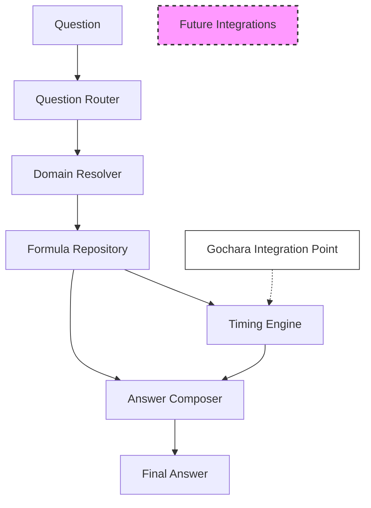

# QUESTION ENGINE ARCHITECTURE

**Date:** 2026-06-19
**Version:** Phase 9 Step 3A Governance Package

## Architecture Overview

The Question Engine processes user queries against the canonical astrological payload generated by the foundational engines (D1, Dasha, Bhava, etc.). It abstracts the astrological reasoning into a configurable pipeline.

### Pipeline Flow

The execution flow for processing a question is as follows:

### Component Definitions

1. **Question:** The input query from the user (e.g., "When will I get married?", "What is my career path?").
2. **Question Router:** Classifies the question into the correct domain (e.g., Marriage, Career) and identifies the intent.
3. **Domain Resolver:** Maps the identified domain to the required Astrological Bhavas, Karakas, and Vargas.
4. **Formula Repository:** Retrieves the externalized astrological formulas required to evaluate the domain.
5. **Timing Engine:** Calculates the timeline for manifestation. Currently uses MVP Dasha layers, with future integration points mapped for Gochara and Ashtakavarga.
6. **Answer Composer:** Synthesizes the raw astrological evaluation into a standardized natural language response.
7. **Final Answer:** The completed response object delivered to the Report Builder.

## Future Integration Points

### Gochara (Transit) Integration
The Timing Engine is designed with an explicit abstraction boundary to accept Gochara modifiers. Future Phase 10 Transit Engines will plug directly into the Timing Engine, acting as an intersection filter against the active Dasha timeline.
