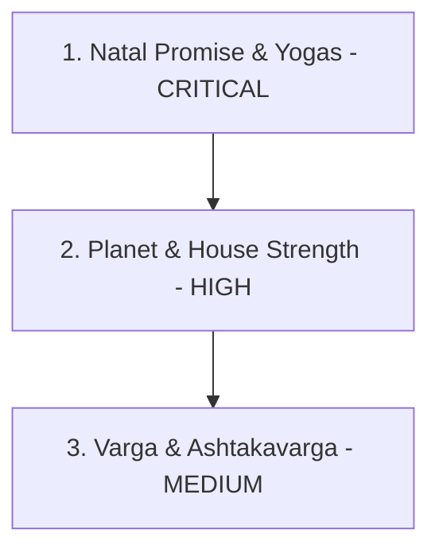

# ASTROLOGY VALIDATION MASTER PLAN

## 1. Objective

The objective of this master plan is to validate whether the implemented mathematical calculations and scoring heuristics in the Vedic-AI computational engines align with classical Parashari Vedic astrology standards. This plan establishes a validation roadmap ordered by business impact, identifies key risks, exposes oversimplified rules, and recommends verification procedures to align the codebase with authentic Vedic texts (e.g., *Brihat Parashara Hora Shastra*).

---

## 2. Validation Roadmap by Business Impact

To maximize value and stability, validation is prioritized from downstream user-facing outputs back to the foundational inputs.

### Phase 1: Natal Promise & Yoga Engines (CRITICAL)
* **Rationale**: These engines directly populate the user-facing report sections (e.g., career, marriage) and trigger the active yogas. Any error here directly impacts the semantic validity of the reports.
* **Audit Focus**: 
  * Verification of the 8 domain scoring weights in `NatalPromiseEngine`.
  * Completeness and correctness of `YogaEngine` rules (Mahapurusha, Raja, Dhana, Arishta, and Neecha Bhanga).

### Phase 2: Planet & House Strength Engines (HIGH)
* **Rationale**: Planetary and bhava strengths form the mathematical inputs for all downstream calculations. Errors here propagate through the entire pipeline.
* **Audit Focus**:
  * Exaltation, debilitation, and own sign dignity bounds.
  * Combustion and retrogression modifiers.
  * House lord strength contribution and benefic/malefic occupancy.

### Phase 3: Varga & Ashtakavarga Engines (MEDIUM)
* **Rationale**: These act as validation overlays and environmental modifiers. While they refine the final score, they do not establish the baseline promise on their own.
* **Audit Focus**:
  * Navamsha (`D9`) and Dashamamsha (`D10`) planet dignity scores.
  * BAV support modifiers and SAV piecewise linear anchors.

---

## 3. Detailed Audit Areas & Gap Analysis

### 1. PlanetStrengthEngine

* **Exaltation & Debilitation**:
  * *Current State*: Reads string-based `"exalted"` and `"debilitated"` states statically from the ingestion payload.
  * *Oversimplification*: Vedic astrology defines exact degrees of deep exaltation/debilitation (e.g., Sun exalted at 10° Aries; Moon at 3° Taurus). The engine ignores the proximity to these degrees, treating all placements within the sign identically.
* **Moolatrikona**:
  * *Missing Rule*: `"moolatrikona"` is defined in `astrology_constants.py` for divisional charts (`D9_SCORES`), but is completely missing from the D1 D1 dignity matrix (`PLANET_SCORING_MATRIX["dignity"]`). In classical Vedic, Moolatrikona is a distinct dignity category stronger than "own sign" but weaker than "exalted".
* **Combustion**:
  * *Oversimplification*: A static modifier (`combust: -20`) is applied based on a boolean. In classical texts, combustion is dependent on the exact angular distance from the Sun, which varies by planet (e.g., Moon 12°, Mars 17°, Mercury 14°, Jupiter 11°, Venus 10°, Saturn 15°). 
* **Retrograde**:
  * *High-Risk Assumption*: Statically adds `+5` points for retrograde motion (Cheshta Bala). However, classical texts state that a retrograde malefic planet behaves differently than a retrograde benefic planet, and retrograde planets in debilitation can have reversed behaviors.
* **Planetary War (Graha Yuddha)**:
  * *Missing Rule*: Graha Yuddha occurs when two planets (excluding Sun, Moon, Rahu, and Ketu) are within 1° of each other. The planet with the lower longitude wins, and the other is defeated. This has a massive impact on Shadbala, but is completely absent from the engine.

### 2. HouseStrengthEngine

* **House Lord Placement**:
  * *Missing Rule*: The engine factors the lord's *strength* (`lord_strength_score * 0.25`), but ignores the lord's *house placement*. For example, if the lord of House 1 is placed in a Dusthana (House 6, 8, or 12), it severely weakens House 1, regardless of the lord's individual strength.
* **Benefic/Malefic Occupancy**:
  * *High-Risk Assumption*: Relies on static classifications (`NATURAL_BENEFICS` and `NATURAL_MALEFICS`) for all charts. In Vedic astrology, planetary functional benefic/malefic status changes dynamically based on the Lagna (Ascendant). For example, for Taurus Lagna, Saturn is a Yogakaraka (highest benefic), and Jupiter is a functional malefic.
* **Aspects**:
  * *Oversimplification*: Evaluates aspects using a flat count of natural benefics/malefics. It ignores special aspects (e.g., Mars aspects 4/7/8; Saturn aspects 3/7/10; Jupiter aspects 5/7/9) and qualitative aspects (e.g., a planet aspecting its own house or its exalted sign significantly strengthens that house).
* **Yogakaraka Effects**:
  * *Missing Rule*: No engine checks for Yogakaraka presence or applies bonuses to the houses ruled or occupied by the Yogakaraka planet.

### 3. VargaEngine

* **D9 & D10 Validation**:
  * *Oversimplification*: Only checks planetary dignity scores in D9 and D10. It ignores house placement, lordships, and aspects within the divisional charts themselves, which are critical for refining marriage (`D9`) and career (`D10`) predictions.
* **Vargottama**:
  * *High-Risk Assumption*: Relies on a pre-calculated `"is_vargottama"` boolean from the parser. The engine should verify this dynamically by checking if the planet occupies the same sign in D1 and D9.
* **Dignity Transfer Rules**:
  * *Missing Rule*: Dispositor dignity transfer (e.g., if planet A's D1 sign lord is exalted or vargottama in D9, planet A inherits functional strength) is completely ignored.

### 4. AshtakavargaEngine

* **SAV & BAV Calculations**:
  * *Current State*: Performs basic validation that the sum of BAV points across the 7 planets matches the SAV count.
  * *Missing Rule*: Classical Ashtakavarga requires two reductions (*Trikona Shodhana* and *Ekadhipatya Shodhana*) to calculate the *Shodhita Pinda* (final reduced bindu score), which is used for timing events and calculating overall planetary/house support. Currently, these reductions are not implemented.
* **Bindu Support Interpretation**:
  * *Oversimplification*: Uses a generic piecewise linear scale for SAV and a linear mapping for BAV. The threshold of BAV strength is planet-specific (e.g., Saturn's average bindu distribution is lower than Jupiter's).

### 5. NatalPromiseEngine

* **Domain Scopes (Marriage, Career, Wealth, etc.)**:
  * *Oversimplification*: Uses a rigid 6-factor formula with static weights. Vedic astrology evaluates domains using specific planetary combinations (Yogas/Dhana Yogas) and house connections (e.g., connection between 2nd, 7th, and 11th houses for marriage; 2nd, 5th, 9th, and 11th houses for wealth). Factoring these as generic "yoga bonuses" rather than core structural relationships reduces prediction accuracy.
  * *Karaka Blending*: Blends primary and secondary significators using simple averages, which can mask the weakness of a primary karaka.

### 6. YogaEngine

* **Pancha Mahapurusha Yogas**:
  * *Current State*: Checks if Mars, Mercury, Jupiter, Venus, or Saturn is in a Kendra and exalted/own/moolatrikona.
  * *Factual Guard*: This logic is structurally correct, but must be validated against the exact sign coordinates to ensure it doesn't activate if the planet is in a Kendra but not in its own/exalted sign in D1.
* **Neecha Bhanga Raja Yoga**:
  * *Oversimplification*: The engine only checks one condition (dispositor of the debilitated planet is in a Kendra from the Ascendant or Moon). Classical Vedic texts define at least five conditions for Neecha Bhanga (e.g., the exaltation lord of the debilitated sign is in Kendra, or the planet is exalted in Navamsha).
* **Raja & Dhana Yogas**:
  * *Oversimplification*: Simply checks for conjunctions, exchanges, or aspects between Kendra/Trikona or Trikona/Wealth lords. It ignores the strength of these lords or the houses involved (a Raja Yoga occurring in a Dusthana house loses most of its positive potency).

---

## 4. Key Risks and Recommendations

### Highest-Risk Astrology Assumptions
1. **Static Benefics vs. Functional Benefics**: Treating Saturn, Mars, Sun, Rahu, and Ketu as universally malefic in house scoring ignores their functional benefic role for specific ascendants, leading to incorrect evaluations.
2. **Generic Domain Weights**: Applying the same weights for all charts assumes that the primary house, karaka, and varga have uniform importance across all configurations, ignoring classical hierarchies.

### Verification Procedure
1. **Canonical Chart Matrix**: Establish a verification suite of 10-15 historical canonical charts with well-documented life events (e.g., charts of famous figures with clear Raja Yogas, bankruptcies, or delayed marriages).
2. **Textual Source Cross-Referencing**: Map every active equation in the codebase to a specific chapter and verse in the *Brihat Parashara Hora Shastra* or *Phaladeepika*, documenting the mathematical translation.
