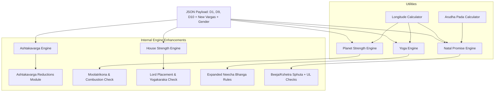

# IMPLEMENTATION DEPENDENCY MAP

## 1. Objective

This document maps the implementation dependencies for the missing and oversimplified astrological rules identified in the **Astrology Validation Master Plan** and the **Natal Promise Validation Audit**. The goal is to integrate these rules into the existing Vedic-AI computational engines using the current architecture, avoiding any structural redesign.

---

## 2. Dependency Categorization

### A. Derivable from Existing `canonical_content.json` (No Schema Changes)
These calculations can be implemented purely in Python within the existing engines by leveraging the planet signs, degrees, house lordships, and Lagna already present in the source JSON:

1. **Jaimini Karakas (Atmakaraka, Amatyakaraka, Darakaraka)**: Calculated dynamically from the D1 planet degrees of the 7 classical planets.
2. **Manglik Blemish (Kuja Dosha)**: Derived by checking Mars's (`Kuja`) house placement.
3. **Moolatrikona Dignity**: Derived by checking planet sign boundaries and degrees.
4. **Planetary War (Graha Yuddha)**: Derived by converting sign and degree to absolute $360^\circ$ longitude and checking for proximity ($< 1^\circ$) between classical planets.
5. **Combustion (exact distance)**: Derived by calculating the absolute longitude distance between the Sun and other planets.
6. **House Lord Placement**: Derived by checking the house location of each house lord (e.g., Lord of 1 in House 8).
7. **Yogakaraka Modifier**: Derived based on the Lagna (Ascendant) sign.
8. **Upapada Lagna (UL)**: Derived by calculating the Arudha Pada of the 12th house (Pisces for Aries Lagna) relative to the placement of its lord (Jupiter).
9. **Beeja & Kshetra Sphuta**: Derived by summing absolute longitudes of Sun + Venus + Jupiter (Beeja) and Moon + Mars + Jupiter (Kshetra).
10. **Maraka & Badhaka Houses**: Derived based on the Lagna sign.
11. **Neecha Bhanga Raja Yoga (Expanded Rules)**: Derived by checking the house placements of the debilitated planet's dispositor and exaltation lord.

### B. New Calculation Modules Required (Internal to Engines)
No new top-level engines are required. We need to implement three helper modules within the existing codebase:

1. **Astrological Longitude Calculator** (Utility inside `app/utils/astrology_math.py`):
   - Converts sign + degree (e.g., Taurus 15°) to absolute coordinates ($0^\circ \text{ to } 360^\circ$) to support Graha Yuddha, combustion, and Sphuta calculations.
2. **Arudha Pada Calculator** (Utility inside `NatalPromiseEngine` / `HouseStrengthEngine`):
   - Computes the Arudha Pada of any house to support Upapada Lagna (UL) and Arudha Lagna (AL).
3. **Ashtakavarga Reduction Module** (inside `AshtakavargaEngine`):
   - Implements *Trikona Shodhana* and *Ekadhipatya Shodhana* to calculate the reduced *Shodhita Pinda*.

### C. New Canonical JSON Fields Required (Schema Extensions)
Because the engines follow a strict "zero recalculation" policy and consume pre-calculated divisional charts, the schema of `canonical_content.json` must be extended to include:

1. **Additional Divisional Charts (Vargas)** under the `"vargas"` node:
   - `D2` (Hora) $\to$ Required for Wealth promise.
   - `D4` (Chaturthansha) $\to$ Required for Property promise.
   - `D7` (Saptamsha) $\to$ Required for Children promise.
   - `D20` (Vimshamsha) $\to$ Required for Spirituality promise.
   - `D24` (Chaturvimshamsha) $\to$ Required for Education promise.
   - `D30` (Trimshamsha) $\to$ Required for Health/Disease promise.
2. **Gender Flag** under `birth_data` $\to$ `"gender": "male" | "female"`:
   - Toggles Venus (male) vs. Jupiter (female) as the primary marriage karaka, and Beeja Sphuta (male) vs. Kshetra Sphuta (female) for children validation.

---

## 3. Dependency Graph

The diagram below shows how the new calculations and schema additions flow into the existing engines without changing the core pipeline architecture.

---

## 4. Recommended Implementation Order

To ensure systematic validation without breaking the system, the enhancements should be implemented in five distinct steps:

### Step 1: Schema Extension & Ingestion Update
* **Task**: Update the `JsonNormalizer` and Pydantic request models to accept the expanded varga charts (D2, D4, D7, D20, D24, D30) and the `gender` flag.
* **Risk**: Low (non-breaking, defaults to baseline if fields are missing).

### Step 2: Utility Calculations
* **Task**: Write the `Longitude Calculator` and `Arudha Pada Calculator` helper functions in `app/utils/astrology_math.py` with corresponding unit tests.
* **Risk**: Low (isolated mathematical utilities).

### Step 3: Foundational Engine Upgrades (Planet & House Strength)
* **Task**: 
  * Update `PlanetStrengthEngine` to calculate combustion distances, Moolatrikona dignity, and Graha Yuddha.
  * Update `HouseStrengthEngine` to check lord placements, Badhaka status, and Yogakaraka modifiers.
* **Risk**: Medium (will change raw scores of planets and houses slightly).

### Step 4: Downstream Engine Upgrades (Yoga & Natal Promise)
* **Task**:
  * Update `YogaEngine` to support the expanded Neecha Bhanga conditions.
  * Update `NatalPromiseEngine` to use gender-specific karakas, Upapada Lagna, and Beeja/Kshetra Sphuta fertility checks.
* **Risk**: Medium-High (will shift final domain scores, requiring updates to test assertions).

### Step 5: Ashtakavarga Reductions
* **Task**: Implement the Trikona and Ekadhipatya reductions inside the `AshtakavargaEngine` to output the Shodhita Pinda.
* **Risk**: Low (isolated calculations that can be validated against manual examples).
